<div align="center">


# 🦐 Thai Fisheries Trade — ML Project

**พยากรณ์ยอดส่งออกสินค้าประมงไทยรายเดือน · จัดกลุ่มตลาดคู่ค้า · เตือนตลาดที่ยอดกำลังจะตก**
*Monthly export forecasting, market segmentation and early warning for Thai seafood, built with CRISP-DM on open data.*


</div>

โปรเจกต์วิชา Machine Learning ใช้ **ข้อมูลเปิดจริง** (UN Comtrade, กรมประมง, World Bank, ECB, Open-Meteo) ตอบคำถามว่า
*"ส่งออกสินค้าประมงไปตลาดไหน เดือนหน้า/อีก 3/6 เดือนจะได้เท่าไร และตลาดไหนกำลังจะแย่?"* — เดินตามขั้นตอน CRISP-DM ครบ
ตั้งแต่ Business Understanding ถึง Deployment (แอป Streamlit ใช้โมเดลจริง)

> 📓 **ทุกอย่างอยู่ใน [`main.ipynb`](main.ipynb)** (มีผลรันและกราฟครบ) · 🌐 ลองแอป: `streamlit run app/app.py`

---

## 🎯 สรุปผลแบบตรงไปตรงมา

โปรเจกต์นี้ตั้งใจ **รายงานตามจริง** ไม่ได้ปรับให้ ML ดูชนะ

| โจทย์ | วิธี | ผลบนช่วงทดสอบ (เม.ย. 2023 – เม.ย. 2026, รันครั้งเดียว) | อ่านผลอย่างไร |
|---|---|---|---|
| **1. พยากรณ์ยอดส่งออกรายเดือน** (ตลาด × สินค้า HS4, 1/3/6 เดือนล่วงหน้า) | LightGBM เทียบ SES · ARIMA/SARIMA · ค่าเฉลี่ยเคลื่อนที่ · seasonal naive · Ridge | WAPE **21.6% / 23.9% / 25.6%** (1/3/6 เดือน) ระดับตลาด-สินค้า · ยอดรวมทั้งประเทศ **5.9% / 5.8% / 7.5%** | ชนะ baseline ที่ดีที่สุด (SES) แค่ราว **5%** ที่ 1–3 เดือน และ **เสมอ** ที่ 6 เดือน — ได้ประโยชน์จริงเมื่อรวมระดับ (ยิ่งรวม ยิ่งแม่น) |
| **1b. ช่วงความไม่แน่นอน 80%** | Quantile LightGBM + conformal (CQR) | coverage จริง **82–84%** (เป้า 80%) | ใช้ประกอบการวางแผนได้ โดยเฉพาะตลาดหลัก |
| **2. จัดกลุ่มตลาด** | K-Means k=4 (พฤติกรรม + สัดส่วนสินค้า) | bootstrap ARI เฉลี่ย **0.69** | กลุ่ม A (35 ประเทศ ≈ **92%** ของมูลค่า) เชื่อถือได้ · กลุ่ม B–D ตลาดเล็ก ผันผวน พยากรณ์พลาดสูง |
| **3. Early Warning** (ยอด 12 เดือนจะตกเกิน 20% ภายใน 6 เดือน) | LightGBM · RF · Logistic เทียบ persistence/run-rate | PR-AUC **0.83** (สุ่ม 0.22) · lift ≈ 4 เท่า | ส่วนใหญ่เป็น "เลขคณิต" — baseline run-rate ได้ 0.79 อยู่แล้ว · เฉพาะตลาดที่ *ยังไม่ตก* PR-AUC 0.72 |

<div align="center">
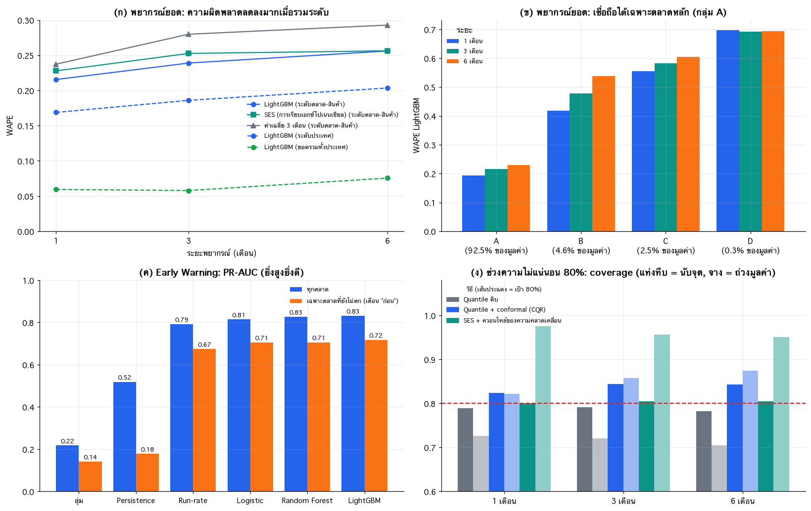
<br/><sub>ภาพสรุปผล (จาก <code>main.ipynb</code> หัวข้อ 5.3)</sub>
</div>

### ⚠️ ข้อจำกัดที่ควรรู้ก่อนนำไปใช้
- **ML ชนะ baseline เล็กน้อยเท่านั้น** (~5%) — ข้อมูลรายตลาด-สินค้าเสียงรบกวนสูง
- **ข้อมูลภายนอก (อัตราแลกเปลี่ยน, World Bank) ไม่ช่วย** ตามการทดลอง ablation
- **เชื่อถือได้เฉพาะตลาดกลุ่ม A และระดับรวม** กลุ่ม B–D พลาดสูง (WAPE 40–70%)
- **Early Warning** ความแม่นส่วนใหญ่มาจากเลขคณิตของยอดที่รู้แล้ว ไม่ใช่การ "ทำนายอนาคตลึก ๆ"
- **เปิดเผยการตัดสินใจหลังเห็นผล:** baseline SES ถูกเพิ่มหลังเห็นผลทดสอบ (ระบุไว้ใน notebook หัวข้อ 5.6)
- เป็นผลงานเพื่อการเรียน **ไม่ใช่คำแนะนำการลงทุน/การค้า**

---

## 🖥️ แอป Streamlit

แอป 6 หน้า ใช้โมเดล LightGBM ที่เทรนแล้วทำนายสด รวมถึงจำลองสถานการณ์ (what-if) ได้

| ภาพรวม | พยากรณ์ + ช่วง 80% |
|:---:|:---:|
| 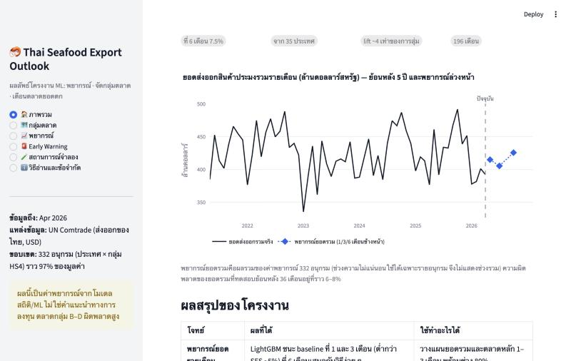 | 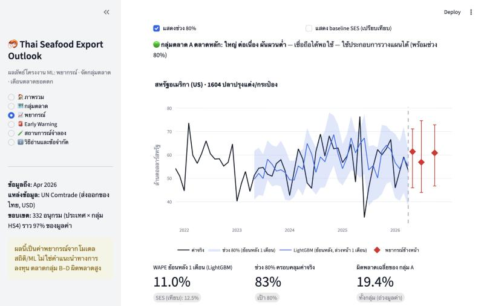 |
| **Early Warning** | **สถานการณ์จำลอง (what-if)** |
| 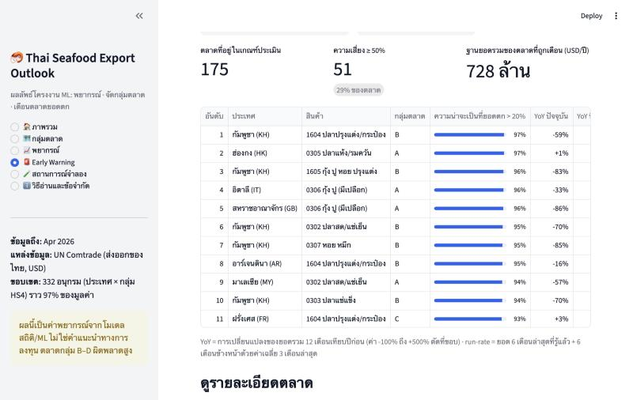 | 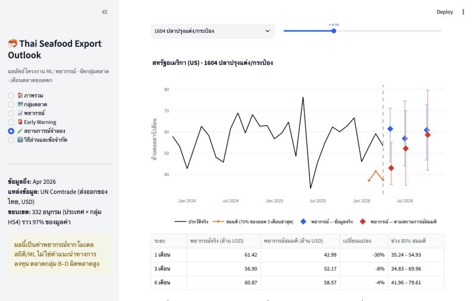 |

```bash
pip install -r app/requirements.txt
streamlit run app/app.py        # เปิด http://localhost:8501
```
รายละเอียด: [`app/README.md`](app/README.md) (macOS: ถ้า LightGBM แจ้งเรื่อง `libomp` ให้ `brew install libomp`)

---

## 📊 ตัวอย่างผลจาก Notebook

<table>
<tr>
<td width="50%">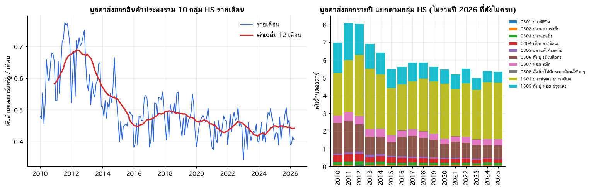<br/><sub><b>Data Understanding:</b> แนวโน้มและโครงสร้างสินค้าส่งออก</sub></td>
<td width="50%">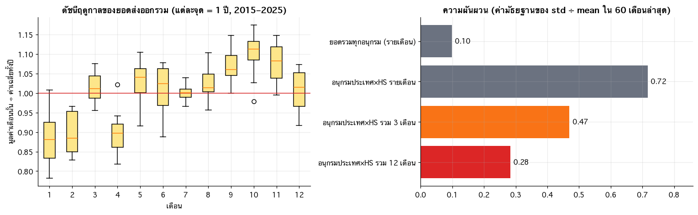<br/><sub><b>ฤดูกาลและความผันผวน</b> — ตัวตัดสินว่าโจทย์พยากรณ์ทำได้แค่ไหน</sub></td>
</tr>
<tr>
<td>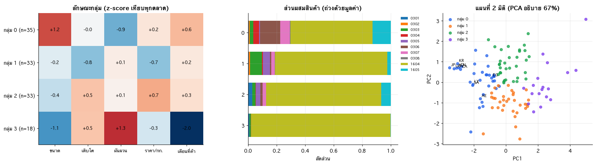<br/><sub><b>Clustering:</b> โปรไฟล์ของแต่ละกลุ่มตลาด</sub></td>
<td>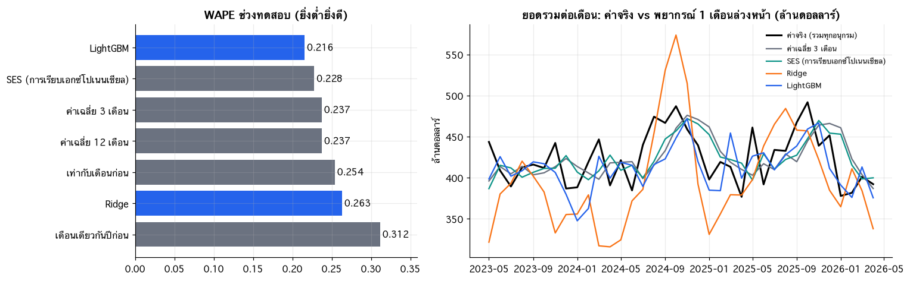<br/><sub><b>Forecasting:</b> ผลช่วงทดสอบเทียบ baseline</sub></td>
</tr>
<tr>
<td>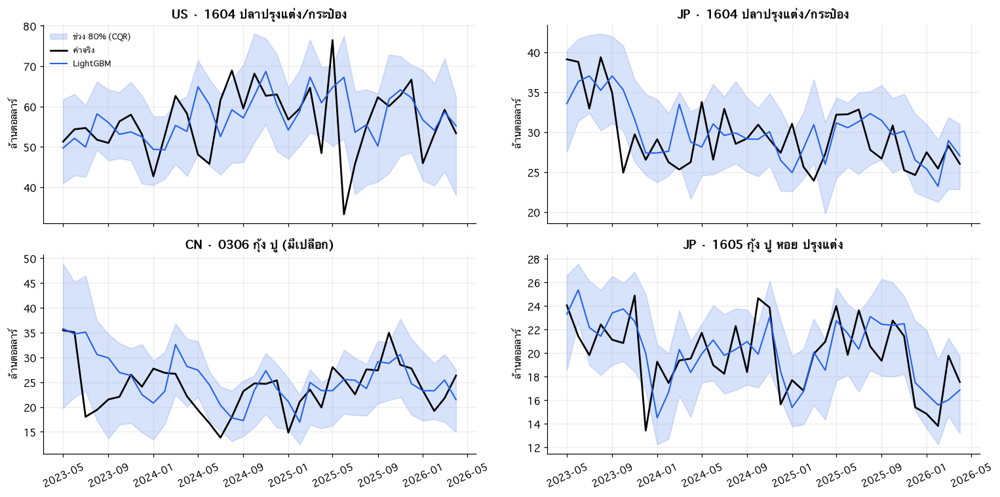<br/><sub><b>ช่วงความไม่แน่นอน 80%</b> (CQR)</sub></td>
<td>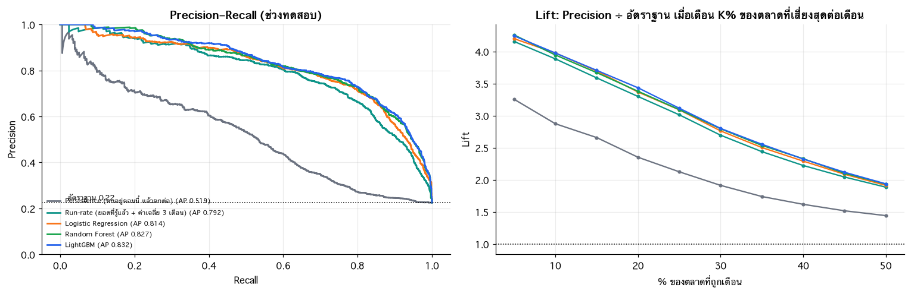<br/><sub><b>Early Warning:</b> เทียบโมเดลกับ baseline</sub></td>
</tr>
</table>

---

## 🧭 ระเบียบวิธี (สิ่งที่ทำเพื่อไม่ให้ผลหลอกตัวเอง)

1. **แบ่งข้อมูลตามเวลาเท่านั้น (rolling-origin, expanding window)** — ปรับโมเดลบนช่วง validation เม.ย. 2019 – มี.ค. 2022 · ช่วงทดสอบ เม.ย. 2023 – เม.ย. 2026 **รันครั้งเดียว**
2. **ทดสอบ data leakage** — ตัดข้อมูลอนาคต คำนวณ feature ใหม่ แล้ว assert ว่าค่าเท่าเดิม
3. **เทียบ baseline เสมอ** — เท่ากับเดือนก่อน, ปีก่อน, ค่าเฉลี่ย 3/12 เดือน, SES, ARIMA/SARIMA, Ridge
4. **รายงานหลายมุม** — WAPE / MAE / RMSE / MAPE / Bias, bootstrap ตาม origin, แยกกลุ่มตลาด·กลุ่มสินค้า·ขนาด·ระยะพยากรณ์
5. **ตรวจความไว** — เปลี่ยนนิยาม Early Warning (threshold/horizon) และความถี่เทรนใหม่ ผลยังคงเดิมไหม
6. **แอปต้องตรงกับ notebook** — feature ต่างกัน ≤ 2e-12, ผลทำนายต่างกัน ≤ 4e-15 (ทดสอบด้วยสคริปต์)

| ขั้น CRISP-DM | อยู่ที่ไหน |
|---|---|
| 1 Business Understanding | `main.ipynb` ส่วน 1 |
| 2 Data Understanding | ส่วน 2 · ภาพนิ่ง [`reports/main_BU_DU.html`](reports/main_BU_DU.html) |
| 3 Data Preparation | ส่วน 3 → ข้อมูลที่เตรียมแล้วใน `Dataset/prepared/` |
| 4 Modeling | ส่วน 4: Clustering · Forecasting · Early Warning |
| 5 Evaluation | ส่วน 5 |
| 6 Deployment | [`app/`](app/) (Streamlit) |

---

## 🗂️ โครงสร้างโปรเจกต์

```
├── main.ipynb                 # Notebook หลัก (CRISP-DM ครบ + ผลรัน)
├── app/                       # แอป Streamlit (app.py, core.py, data/, models/)
├── scripts/                   # ดึง/ทำความสะอาดข้อมูล, สร้าง asset ของแอป, ทดสอบ
├── Dataset/
│   ├── external/              # Comtrade, อัตราแลกเปลี่ยน, World Bank, สภาพอากาศ
│   ├── clean/                 # ข้อมูลกรมประมงที่ทำความสะอาดแล้ว
│   ├── prepared/              # ผลจาก Data Preparation/Modeling (panel, clusters, ผลทดสอบ)
│   └── DICTIONARY.md          # คำอธิบายทุกไฟล์ + metadata
├── reports/                   # ภาพนิ่ง HTML ของ BU + DU
└── assets/                    # banner และภาพประกอบ README
```
อธิบายทุกไฟล์ข้อมูล: [`Dataset/DICTIONARY.md`](Dataset/DICTIONARY.md)

---

## 📦 แหล่งข้อมูล (Open Data)

| ข้อมูล | แหล่ง | บทบาท |
|---|---|---|
| การส่งออกสินค้าประมงรายเดือน × ประเทศ × HS4 (2010–2026) | [UN Comtrade](https://comtradeplus.un.org/) | **ข้อมูลหลัก** สำหรับพยากรณ์/จัดกลุ่ม/เตือน |
| นำเข้า-ส่งออกรายเดือน/รายวัน, ใบรับรองสุขภาพสัตว์น้ำ, ผลผลิต | [กรมประมง — Open Data](https://catalog.fisheries.go.th/) | ทำความเข้าใจข้อมูลและตรวจข้าม |
| อัตราแลกเปลี่ยน | [Frankfurter API](https://frankfurter.dev/) (อัตราอ้างอิง ECB) | ตัวแปรภายนอก |
| GDP, ประชากร, เงินเฟ้อ | [World Bank Open Data](https://data.worldbank.org/) (CC BY 4.0) | ตัวแปรภายนอก |
| สภาพอากาศรายวัน | [Open-Meteo](https://open-meteo.com/) (ERA5, CC BY 4.0) | ตัวแปรภายนอก |

ตรวจสอบเงื่อนไขการใช้งานของแต่ละแหล่งก่อนนำข้อมูลไปเผยแพร่ซ้ำ

---

## 🔁 รันซ้ำ

```bash
# 1) ติดตั้ง
python -m venv .venv && source .venv/bin/activate
pip install pandas numpy matplotlib scikit-learn lightgbm statsmodels plotly streamlit jupyter

# 2) เปิด notebook (มีผลรันบันทึกไว้แล้ว ดูได้เลยโดยไม่ต้องรันใหม่)
jupyter lab main.ipynb

# 3) ดึงข้อมูลภายนอกใหม่ (ถ้าต้องการ)
python scripts/fetch_external_data.py            # fx, wb, wx
python scripts/fetch_external_data.py fxlong wblong
python scripts/fetch_comtrade.py                 # ต้องใช้อินเทอร์เน็ต; โควตา API จำกัด สคริปต์รอและทำต่อจาก cache ได้

# 4) สร้างโมเดล/ข้อมูลของแอปใหม่ และทดสอบว่าตรงกับ notebook
python scripts/build_app_assets.py
python scripts/test_app_features.py
```

> **หมายเหตุเรื่องขนาดข้อมูล:** ไฟล์รายวันขนาดใหญ่ (`Dataset/clean/trade/trade_daily_*.csv` หลายร้อย MB) ไม่ได้อยู่ใน repo — สร้างใหม่ได้ด้วย `scripts/clean_data.py` จากไฟล์ต้นฉบับ

---

## 👥 ผู้จัดทำ

> _(ใส่ชื่อผู้จัดทำ · รายวิชา · อาจารย์ที่ปรึกษา)_

<div align="center">

<sub>🐟 ทำด้วยข้อมูลเปิด และความตั้งใจรายงานผลตามจริง 🌊</sub>
</div>
